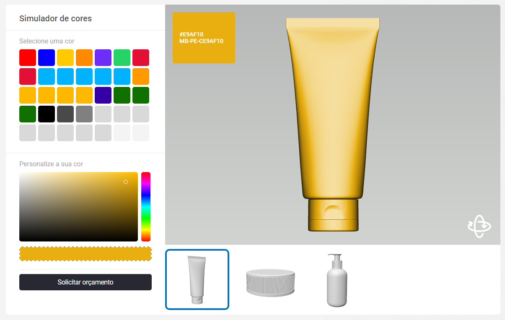

--------- CUSTOM COLOR CHANGE SIMULATOR IN 3D OBJECTS ---------

--------- Follow these steps to make it work in any case ! ----

1. Call all necessary scripts:

<link rel="stylesheet" href="ColorSimujs/css/style.css">
<link rel="preload" as="style" href="ColorSimujs/css/style.css">

  
  
  
  
  

--------------------------------- ATENTION !! --------------------------------- 

- There's an array variable called "modelsArray" that need to be populated with the 3d objects's URL for the object to be rendered into the <canvas> Tag. 
- It needs to be populated before calling the main.js file

Ex.

  
  

-------------------------------------------------------------------------------

2. There's two main functions that can be used to change both the Color and the 3D Model on the Page:

- To change the Object's color, use:

    - colorSimulator.update(HexString,colorCode);

    - Parameters: 

        - HexString - The color to be changed and applied into the Object.
          Default: #FADF60

        - colorCode - The code of the specified color.
          Default: MB-PE-C + HexString

- To change the 3D Model, use:

    - viewer.replaceSceneFromUrl(objectUrl);

    - Parameters:

        - objectUrl - The Object URL.
          Default: dove.obj

-------------------------------------------------------------------------------

3. Wordpress's Media Library doesn't allow .obj or .mtl file types for security measures, to enable unallowed file types, add the following code inside the functions.php file. That will make the Wordpress's Media Library treat the files as .txt

-------------------------------------------------------------------------------

function custom_mime_types($mime_types) { 
&nbsp;&nbsp;&nbsp;&nbsp;&nbsp;&nbsp;&nbsp;&nbsp;$mime_types['obj'] = 'text/plain'; 
&nbsp;&nbsp;&nbsp;&nbsp;&nbsp;&nbsp;&nbsp;&nbsp;return $mime_types; 
} 
add_filter('upload_mimes', 'custom_mime_types'); 

-------------------------------------------------------------------------------

4. The HTML Structure for the Library is:

&lt;div id="canvas"&gt; 
&nbsp;&nbsp;&nbsp;&nbsp;&lt;div class="colorcode"&gt;&lt;/div&gt; 
&nbsp;&nbsp;&nbsp;&nbsp;&lt;canvas id="viewer" width="800" height="575"&gt;&lt;/canvas&gt; 
&nbsp;&nbsp;&nbsp;&nbsp;&lt;div class="arrows"&gt; 
&nbsp;&nbsp;&nbsp;&nbsp;&nbsp;&nbsp;&nbsp;&nbsp;&lt;div class="prev"&gt;&lt;/div&gt; 
&nbsp;&nbsp;&nbsp;&nbsp;&nbsp;&nbsp;&nbsp;&nbsp;&lt;div class="next"&gt;&lt;/div&gt; 
&nbsp;&nbsp;&nbsp;&nbsp;&lt;/div&gt; 
&lt;/div&gt;   

